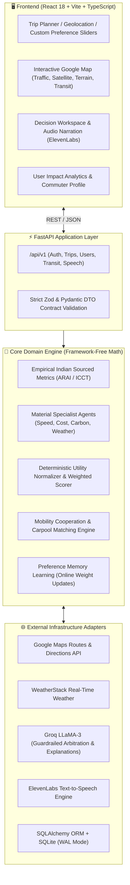

<div align="center">

# 🌱 GreenRoute Negotiator
### *AI-Powered Multi-Modal Urban Mobility & Deterministic Multi-Agent Negotiation Engine*

[](https://fastapi.tiangolo.com)
[](https://react.dev)
[](https://www.typescriptlang.org/)
[](https://developers.google.com/maps)
[](https://www.sqlalchemy.org/)
[](https://groq.com)
[](https://elevenlabs.io)

<p align="center">
  <b>Bridging the Gap Between Multi-Modal Transit and Commuter Decision-Making in Indian Metros</b><br>
  <i>Empirical Carbon Models • Material Specialist Agents • Guardrailed LLM Arbitration • Mobility Cooperation</i>
</p>

---

</div>

## 📌 Executive Summary

Urban transport in Indian metropolitan hubs generates over **14% of national greenhouse gas emissions** and severe air quality crises. Commuters routinely default to high-carbon single-occupancy vehicles due to cognitive friction in comparing door-to-door transit times, hidden ownership expenses, and air quality exposure.

**GreenRoute Negotiator** solves this through a **decision-theoretic AI engine**:
1. **Live Multi-Modal Routing**: Queries Google Maps for real-time **Car**, **Two-Wheeler** (narrow pathway optimization), **Cycling**, **Bus**, and **Metro** routes with transit stop discovery.
2. **Empirical Indian Emission Baselines**: Grounded in official **ARAI**, **MoRTH**, **BEE CAFE Stage II**, and **ICCT India (2024)** lifecycle studies with realistic on-road multipliers (1.4× for cars, 1.2× for two-wheelers).
3. **Material Specialist AI Agents**: Four autonomous agents (**Speed**, **Cost**, **Carbon**, **Weather**) propose bounded mathematical adjustments (parking search, ownership depreciation, AQI respiratory exposure, rain caution) *before* scoring.
4. **Deterministic Utility Engine**: Mathematically calculates the winning mode using min-max normalization and personalized preference weights.
5. **Guardrailed Multi-Agent Arbitration**: A Groq-powered multi-agent debate and explanation layer that is mathematically constrained—the LLM explains and arbitrates the outcome, but is strictly prohibited from altering or hallucinating the winning decision.
6. **Mobility Cooperation & Impact Tracking**: Dynamic commuter carpool matching and a personal **Impact Dashboard** quantifying CO₂ avoided, money saved, and trees preserved.

---

## 🏛️ System Architecture

GreenRoute is built on **Domain-Driven Design (DDD)** principles. The domain layer contains **pure Python business logic** with zero external dependencies, guaranteeing 100% reproducible and testable decision math.



---

## 🔬 Scientific & Empirical Grounding

Unlike typical trip planners that rely on arbitrary assumptions, GreenRoute's carbon and financial metrics are derived from verified empirical data:

```
Real-World Mileage (km/L) = [Official Petrol Emission Factor (2,310 g CO₂/L)] / [Adopted Real-World Carbon (gCO₂/km)]
Trip Cost (₹) = [Distance (km) / Real-World Mileage (km/L)] × [Retail Petrol Price (₹102.12/L)]
```

### Official Carbon & Cost Matrix

| Mode | Regulatory Baseline | Real-World Multiplier | Adopted Emission (`gCO₂/km`) | Implied Mileage | Derived Fuel Cost (`₹/km`) | Primary Sourced Basis |
|:---|:---:|:---:|:---:|:---:|:---:|:---|
| **🚗 Car (ICE)** | 113.0 g/km | **1.4×** (ICCT Gap) | **158.2** | 14.6 km/L | **₹6.99** | BEE CAFE Stage II ceiling + on-road traffic & AC penalty |
| **🛵 Two-Wheeler** | 38.2 g/km | **1.2×** (ICCT Gap) | **45.8** | 50.4 km/L | **₹2.03** | ICCT FY2020-21 Indian 2W fleet average |
| **🚌 Public Bus** | ~1000 g/km (WTW) | Allocated per pax | **25.0** / pax-km | — | **₹1.50** | ICCT HDV Lifecycle (urban diesel/CNG, 40 pax occupancy) |
| **🚇 Metro Rail** | Grid electric | Allocated per pax | **15.0** / pax-km | — | **₹2.50** | Electrified high-capacity urban mass transit |
| **🚲 Cycling** | 0 g/km | — | **0.0** | — | **₹0.00** | Zero tailpipe emissions |

---

## 🤖 The 4 Specialist Agents & Material Decision Layer

Each specialist agent is **materially load-bearing**. They do not just generate text; they inject deterministic deltas on their specific channel:

```text
1. 🏎️ Speed Agent   --> Adds Door-to-Door Parking Search (+4.0 min Car, +1.5 min 2W, +0.5 min Cycle).
2. 💰 Cost Agent    --> Adds Real Marginal Ownership Share (+60% Car parking/tolls, +35% 2W servicing).
3. 🌿 Carbon Agent  --> Adds Ambient AQI Inhalation Exposure Penalty (scales with ventilation rate).
4. 🌧️ Weather Agent --> Injects Rain Caution Delays (+15 min 2W, +10 min Cycle during active rainfall).
```

### The Guardrailed Arbitration Guarantee
```python
# domain/negotiation/interfaces.py
def validate_transcript(transcript: str, computed_winner: str) -> None:
    """Rejects any LLM output that attempts to override the mathematically computed winner."""
    if declared_winner != computed_winner:
        raise CoordinatorOverrideError(f"LLM hallucinated winner: {declared_winner} != {computed_winner}")
```

---

## 🚀 Quick Start (Under 2 Minutes)

### 1. Prerequisites
- **Python**: 3.11+ or 3.12
- **Node.js**: v20+ or v22+
- **Google Maps API Key** (Routes, Directions, Places)

### 2. Backend Setup
```bash
cd backend

# Create & activate virtual environment
python -m venv .venv
.\.venv\Scripts\activate      # Windows
source .venv/bin/activate     # macOS / Linux

# Install dependencies
pip install -e .

# Configure environment
cp .env.example .env          # Add your GOOGLE_MAPS_API_KEY and GROQ_API_KEY

# Launch FastAPI
uvicorn app.main:app --reload --port 8000
```
*Interactive Swagger API Docs available at: `http://localhost:8000/docs`*

### 3. Frontend Setup
```bash
cd frontend

# Install packages
npm install

# Start Vite dev server
npm run dev
```
*Web App live at: `http://localhost:5173`*

---

## 🧪 Interactive Evaluation Scenarios for Judges

Try these real scenarios in the interactive planner:

| Scenario | Input Settings | Agent Behavior | Winning Decision |
|---|---|---|---|
| **Heavy Rain Rush Hour** | Trip across city + Weather Agent active | Weather Agent adds rain caution penalties to two-wheelers & cycling | **🚇 Metro / Bus** |
| **Severe AQI Pollution** | Ambient AQI = 280 (Severe) | Carbon Agent severely penalizes heavy exertion in open cycling | **🚗 Carpool / Metro** |
| **Budget Commute** | Stated Priority = "Cost" (w_cost = 0.7) | Utility engine favors public transit and high-mileage 2W | **🚌 Public Bus (₹15)** |
| **Commuter Cooperation** | Car selected + "Willing to Carpool" | Mobility Cooperation matches nearby commuters for 50% split | **🤝 Carpool Relay** |

---

## 📂 Project Structure

```text
GreenRoute_Negotiator/
├── backend/
│   ├── app/
│   │   ├── main.py                     # FastAPI composition root, CORS & lifecycle
│   │   ├── api/
│   │   │   ├── routers/                # Auth, Trips, Users, Speech, Transit, Health
│   │   │   ├── dependencies.py         # Clean dependency injection container
│   │   │   └── error_handlers.py       # Domain error -> HTTP status mapping
│   │   ├── application/use_cases/      # Application orchestration layer
│   │   ├── domain/                     # 100% Framework-free business logic & math
│   │   │   ├── decision/               # Utility normalization & switch policy
│   │   │   ├── negotiation/            # Specialist agent adjustments & guardrails
│   │   │   ├── cooperation/            # Carpool & commuter relay matching
│   │   │   └── preference/             # Online preference learning logic
│   │   ├── infrastructure/
│   │   │   ├── database/               # SQLAlchemy ORM models & session (WAL mode)
│   │   │   ├── routing/google_maps/    # Google Maps Routes API client & transit routing
│   │   │   ├── enrichment/             # Sourced static cost and carbon factors
│   │   │   ├── llm/                    # Groq client, prompts & deterministic fallback
│   │   │   └── speech/                 # ElevenLabs text-to-speech integration
│   │   └── schemas/                    # Pydantic DTOs for requests and responses
│   └── pyproject.toml                  # Python package specifications
│
├── frontend/
│   ├── src/
│   │   ├── app/                        # Router, AuthProvider, ErrorBoundary
│   │   ├── components/                 # Layout (Header, Footer), Glassmorphic UI
│   │   ├── features/map/               # Google Maps view, traffic layers, style selectors
│   │   ├── pages/
│   │   │   ├── Auth/                   # Standalone Login and Sign Up views
│   │   │   ├── Home/                   # Trip search form, presets, custom sliders
│   │   │   ├── TripWorkspace/          # Comparison cards, agent debate, audio narration
│   │   │   ├── ImpactDashboard/        # Personal carbon avoided, cost saved, trees saved
│   │   │   └── Profile/                # Commuter profile & sustainability badges
│   │   ├── services/api/               # Fetch client & Zod schemas matching backend DTOs
│   │   └── styles/                     # Tailwind CSS & glassmorphic tokens
│   ├── package.json
│   └── vite.config.ts
├── PROGRESS.md                         # Detailed project evolution snapshot
├── LICENSE                             # MIT Open-Source License
└── README.md
```

---

## 🎯 UN Sustainable Development Goals (SDG) Alignment

- **SDG 11: Sustainable Cities and Communities (Target 11.2)**: Providing access to safe, affordable, accessible, and sustainable transport systems for all.
- **SDG 13: Climate Action (Target 13.3)**: Improving education, awareness-raising, and human capacity on climate change mitigation through real-time footprint feedback.

---

## 📜 License & Acknowledgments

This project is licensed under the **MIT License** — see the [LICENSE](LICENSE) file for details. Built with passion for sustainable urban mobility.
